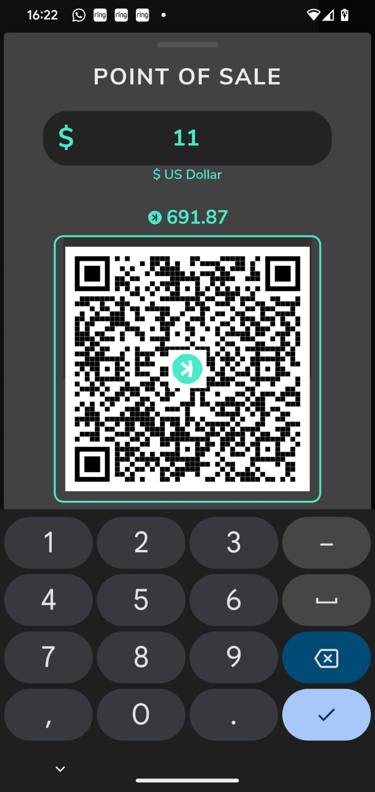
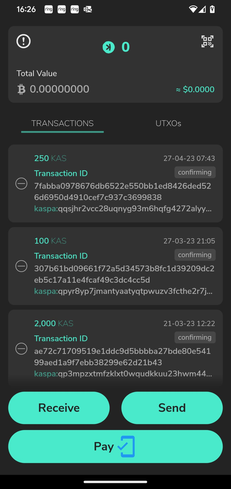
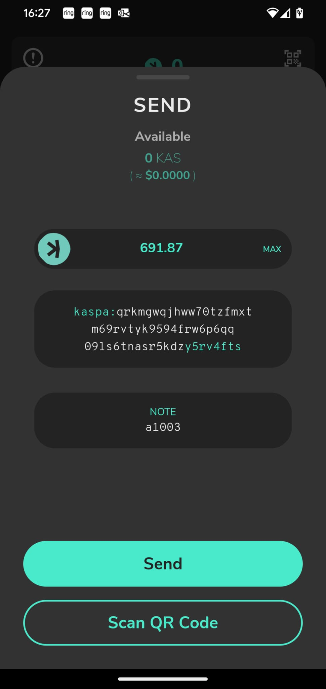

### Please read below about this fork.

# Kaspium - a non-custodial wallet for Kaspa blockDAG

## What is Kaspium?

Kaspium is a non-custodial wallet for Kaspa, avaialble for Android and iOS. It is written in [Dart](https://dart.dev) using [Flutter](https://flutter.dev).

| Link | Description |
| :----- | :------ |
[kaspium.io](https://kaspium.io) | Kaspium Homepage
[kaspa.org](https://kaspa.org) | Kaspa Blockchain Homepage

## Contributing

* Fork the repository and clone it to your local machine
* Follow the instructions [here](https://flutter.io/docs/get-started/install) to install the Flutter SDK
* Setup [Android Studio](https://flutter.io/docs/development/tools/android-studio) or [Visual Studio Code](https://flutter.io/docs/development/tools/vs-code).

## Building

Android: `flutter build apk`
iOS: `flutter build ios`

If you have a connected device or emulator you can run the app with `flutter run` for debug or `flutter run --release` for release mode.

## Have a question?

If you need any help, feel free to file an issue if you do not manage to find a solution.

## License

Kaspium is released under the MIT License

## About this Fork
I am currently exploring retail solutions using Kaspa. As part of this exploration, I have implemented a point-of-sale page designed for retail stores to conveniently present customers with a payment option.
The key distinction between the standard "Send" and "Receive" options and this "Pay" solution lies in the user's ability to scan not only the recipient **address** but also the **amount** and the **note** (all given by the seller).
My model scenario is buying a cup of coffee at the shop around the corner, using contactless payment of Kaspa. It's currently illustrated with QR Code scanning, and in the future I will look into NFC.

